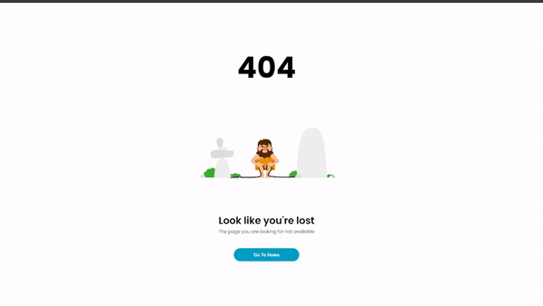

# Error 404 Page

This project is a simple HTML and CSS implementation of a custom 404 error page.

## Project Structure

- `index.html`: The main HTML file that contains the structure of the 404 error page.
- `css/style.css`: The CSS file that styles the 404 error page.
- `js/script.js`: A JavaScript file (currently empty) for any future enhancements.
- `src/`: A directory for any additional source files.

## Usage

To use this 404 error page, simply open the `index.html` file in a web browser.

## Features

- Custom 404 error message
- Responsive design
- Styled using Google Fonts and custom CSS

## CSS Highlights

- The page uses the Poppins font from Google Fonts.
- The `body` is styled to center the content both vertically and horizontally.
- The `h1` element displays the "404" error code with a large font size.
- The `img` element displays an error GIF.
- The `.text` class styles the text content, including a heading and a paragraph.
- The `button` element is styled with a background color, border radius, and hover effect.

## Example

## License

This project is licensed under the MIT License.